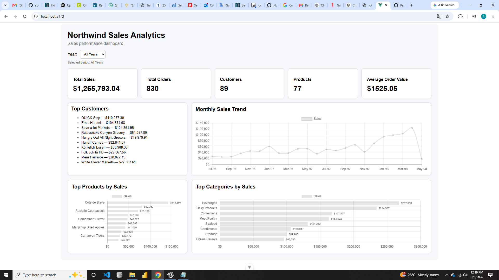
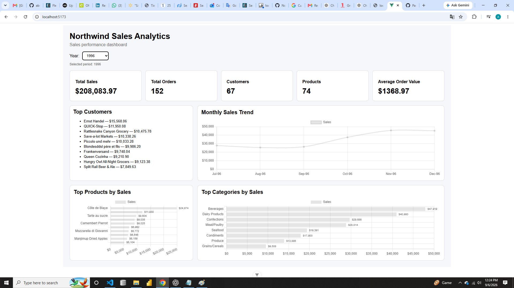
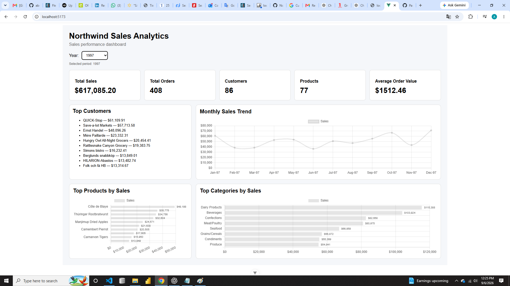
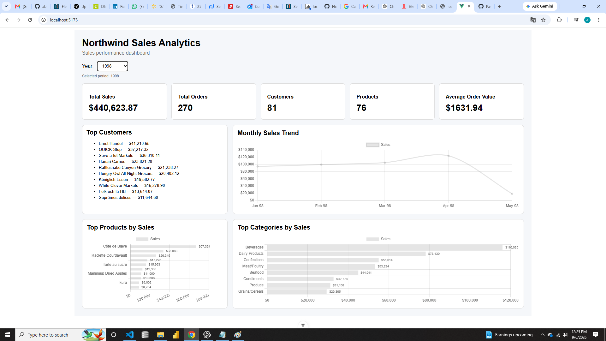

# Northwind Sales Analytics Dashboard

A full-stack sales analytics dashboard built with Vue.js, Node.js, Express, and SQL Server using the Northwind database.

**Author:** Abelardo Suarez

---

## Overview

The Northwind Sales Analytics Dashboard is a portfolio project designed to demonstrate the development of a business-oriented analytics application using a modern web stack.

The application retrieves sales data from SQL Server through a REST API and presents the results through an interactive Vue.js dashboard.

The dashboard provides sales KPIs, customer rankings, monthly sales trends, top products, and sales by category.

---

## Business Objective

The objective of this project is to transform transactional sales data from the Northwind database into an interactive analytics dashboard that allows users to quickly evaluate sales performance.

The dashboard supports analysis for:

- All available years
- 1996
- 1997
- 1998

Users can change the selected year and the dashboard retrieves the corresponding data from the API.

---

## Solution Architecture

The application follows a three-layer architecture:

```text
┌─────────────────────────────┐
│        Vue.js Frontend      │
│                             │
│  Dashboard / Charts / KPIs  │
└──────────────┬──────────────┘
               │ HTTP REST API
               ▼
┌─────────────────────────────┐
│      Node.js + Express      │
│                             │
│       REST API Layer        │
└──────────────┬──────────────┘
               │ ODBC
               ▼
┌─────────────────────────────┐
│        SQL Server           │
│                             │
│         Northwind           │
└─────────────────────────────┘
```

### Data Flow

```text
SQL Server / Northwind
        ↓
Node.js + Express API
        ↓
HTTP / JSON
        ↓
Vue.js
        ↓
Interactive Dashboard
```
---

## Dashboard Screenshots

### All Years



### 1996



### 1997



### 1998



---

## Dashboard Features

### Key Performance Indicators

The dashboard displays:

- Total Sales
- Total Orders
- Customers
- Products
- Average Order Value

### Sales Analysis

The dashboard includes:

- Top 10 Customers by Sales
- Monthly Sales Trend
- Top 10 Products by Sales
- Sales by Category

### Year Filter

The dashboard supports:

- All Years
- 1996
- 1997
- 1998

Changing the year updates the dashboard data through the REST API.

---

## Technology Stack

### Frontend

- Vue.js 3
- Vite
- Chart.js
- vue-chartjs
- chartjs-plugin-datalabels
- JavaScript
- HTML5
- CSS3

### Backend

- Node.js
- Express
- CORS
- dotenv
- msnodesqlv8
- Microsoft SQL Server

### Database

- Northwind
- SQL Server
- ODBC Driver 18 for SQL Server
- Windows Trusted Connection

### Development Tools

- Visual Studio Code
- PowerShell
- Git
- GitHub

---

## REST API

The backend exposes the following endpoints.

| Endpoint | Description |
|---|---|
| `/api/health` | API health check |
| `/api/dashboard` | Dashboard KPI summary |
| `/api/top-customers` | Top 10 customers by sales |
| `/api/monthly-sales` | Monthly sales trend |
| `/api/top-products` | Top 10 products by sales |
| `/api/top-categories` | Sales by product category |

### Year Filtering

The analytical endpoints support an optional `year` parameter.

Example:

```text
/api/dashboard?year=1997
```

Supported values:

```text
1996
1997
1998
```

When the parameter is omitted, the API returns data for all available years.

---

## Project Structure

```text
Northwind_Vue_Dashboard/
│
├── api/
│   ├── db.js
│   ├── server.js
│   ├── test-db.js
│   ├── package.json
│   └── .gitignore
│
├── public/
│
├── src/
│   ├── components/
│   │   ├── KpiCard.vue
│   │   ├── TopCustomers.vue
│   │   ├── MonthlySalesTrend.vue
│   │   ├── TopProducts.vue
│   │   └── TopCategories.vue
│   │
│   ├── App.vue
│   └── main.js
│
├── .gitignore
├── eslint.config.js
├── index.html
├── package.json
├── package-lock.json
├── vite.config.js
└── README.md
```

---

## Database Configuration

The backend connects to SQL Server using environment variables.

Create:

```text
api/.env
```

Example:

```env
DB_SERVER=localhost
DB_DATABASE=Northwind
DB_TRUST_SERVER_CERTIFICATE=true
```

The `.env` file is excluded from source control.

The application uses Windows Trusted Connection through ODBC Driver 18 for SQL Server.

---

## Installation

### Frontend

From the project root:

```powershell
npm install
```

### Backend

```powershell
cd api
npm install
```

---

## Running the Application

The frontend and backend run independently.

### Start the API

From the project root:

```powershell
node api\server.js
```

The API runs at:

```text
http://localhost:3000
```

### Start the Vue application

Open another terminal:

```powershell
npm run dev
```

The Vue development server runs at:

```text
http://localhost:5173
```

Open the frontend in a browser to view the dashboard.

---

## API Validation

The API was validated against the Northwind database.

Health check:

```text
GET /api/health
```

Expected response:

```json
{
  "status": "OK",
  "message": "Northwind API is running"
}
```

Dashboard validation for all years returned:

```text
Total Orders : 830
Customers    : 89
Products     : 77
Total Sales  : 1,265,793.0396
```

The dashboard API was also validated using year-specific requests for 1996, 1997, and 1998.

---

## Code Quality

The frontend project uses ESLint for code-quality validation.

Run:

```powershell
npm run lint
```

The project also supports a production build:

```powershell
npm run build
```

The production build generates the `dist` directory.

---

## Security Considerations

Database credentials and environment-specific configuration are stored in:

```text
api/.env
```

The `.env` file is excluded from Git using `.gitignore`.

The project does not store database credentials directly in the source code.

---

## Portfolio Skills Demonstrated

This project demonstrates practical experience in:

- SQL Server
- SQL data analysis
- Relational database querying
- REST API development
- Node.js
- Express
- Vue.js
- JavaScript
- Chart.js
- Data visualization
- KPI development
- Business analytics
- Year-based filtering
- Full-stack application architecture
- API/database integration
- Data validation
- Code quality and linting
- Git/GitHub project organization

---

## Professional Value

This project demonstrates the ability to take transactional database data and transform it into a business-oriented analytics solution.

It combines database knowledge, SQL analysis, backend API development, and frontend data visualization into a single portfolio project.

The architecture also provides a practical separation between the database, API, and presentation layers.

---

## Author

**Abelardo Suarez**

Computer Engineer with extensive experience in enterprise systems, SQL, IBM mainframe environments, COBOL, ADABAS/Natural, IMS, data processing, and business-oriented information systems.

This project represents a transition of that enterprise data experience into a modern full-stack analytics application.